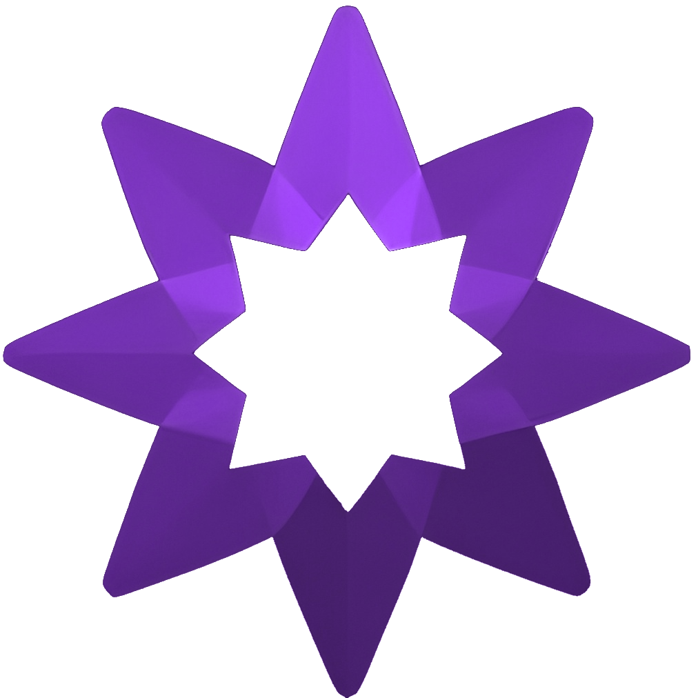

# ShootStars - Aplicación Web de Mensajes Efímeros



## Descripción
ShootStars es una aplicación web que permite a los usuarios dejar mensajes efímeros para que otros usuarios los vean de forma aleatoria. Los usuarios pueden reaccionar a los mensajes con "me gusta" o emoticonos y reportar contenido inapropiado. La temática de la aplicación se inspira en el espacio y las estrellas fugaces.

La aplicación incluye funcionalidades de registro e inicio de sesión con doble autenticación, panel de control para gestionar mensajes y un sistema de moderación administrado por un administrador.

## Sitio web
Puedes acceder a la aplicación web en: [https://shootstars.sytes.net](https://shootstars.sytes.net)

## Funcionalidades principales
- Visualización de mensajes aleatorios.
- Interacciones con los mensajes (reacciones y reportes).
- Registro e inicio de sesión con doble autenticación.
- Panel de control para los usuarios registrados:
  - Ver, editar y eliminar sus propios mensajes.
  - Consultar reacciones de otros usuarios.
- Sistema de reportes para moderación:
  - Notificación al administrador cuando se superen ciertos reportes.
  - Gestión manual de mensajes reportados.
- Diseño responsive y atractivo.
- Despliegue en servidor local propio.

## Tecnologías utilizadas
  <div align="left">
    
    
    
    
    
    
    
    
    
    
    
    
    
    
    
    
  </div>
- **Frontend:** HTML, CSS y JavaScript
- **Backend:** PHP
- **Base de datos:** MySQL
- **Correo electrónico:** PHPMailer para envío de códigos de doble autenticación y notificaciones
- **Servidor:** Apache2 en Debian

## Herramientas de desarrollo
<div align="left">
  
  
  
  
  
  
</div>
- Visual Studio Code
- Git y GitHub
- MySQL Workbench

## Instalación y despliegue
1. Clonar el repositorio:
   ```bash
   git clone https://github.com/tu-usuario/shootstars.git


